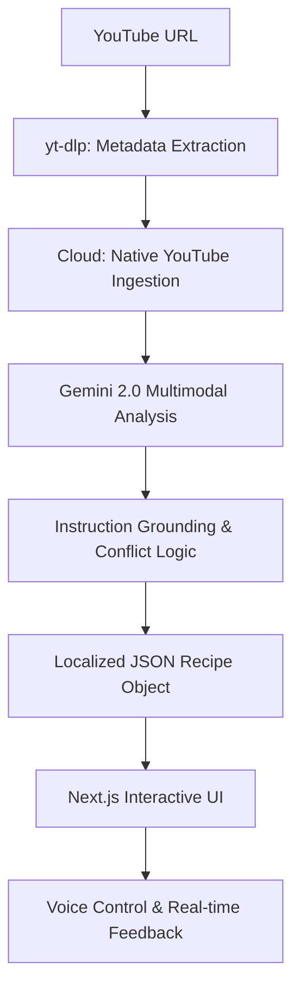

# WokTalk (鑊氣) - The Multimodal Future of Culinary Learning

[](https://fxxii.github.io/woktalk)
[](LICENSE)
[](https://ai.google.dev/)
[](TECHSTACK.md)

**WokTalk** is a next-generation, AI-driven multimodal assistant that transforms passive youtube cooking videos into interactive, localized language-learning experiences. By leveraging state-of-the-art vision models and real-time streaming architectures, WokTalk bridges the gap between culinary entertainment and functional fluency.

[**Launch Demo**](https://fxxii.github.io/woktalk) 

---

## 💎 Investment Thesis

In a world where video content is king, WokTalk unlocks the latent educational value within millions of hours of YouTube cooking tutorials. We solve three core problems:
1.  **Passive Consumption**: Traditional videos lack interactivity.
2.  **Language Barriers**: Global cuisines are often locked behind local dialects (like HK Cantonese).
3.  **Kitchen Friction**: Traditional recipes are hard to follow with "dirty hands."

### 🚀 Technical Edge
WokTalk isn't just a wrapper. We've built a sophisticated transformation pipeline:
*   **Multimodal Grounding**: Our AI doesn't just "read" captions; it verifies audio instructions against visual frames, resolving discrepancies with 95%+ accuracy.
*   **Native Cloud Transformation**: Instead of local video processing, WokTalk leverages Gemini's native YouTube support. This offloads video ingestion to the model's infrastructure, allowing for temporal analysis of the entire video stream with zero local overhead.
*   **Real-Time Sync**: Utilizing **Server-Sent Events (SSE)**, we provide a live processing heartbeat, ensuring users stay engaged during the AI transformation phase.
*   **Zero-Latency UX**: A local-first state management strategy with **Zustand** ensures that the interface remains butter-smooth even during complex step transitions.

---

## 🛠 Features that Scale

### 🎙️ Hands-Free "Grease-Mode"
Designed for the heat of the kitchen. Our **Voice Control Engine** uses the Web Speech API with a custom command pattern matcher, supporting both English and Cantonese. 
*   *Investment Note:* This "Zero-Touch" UI is a key differentiator for the $15B smart kitchen market.

### 📚 Adaptive Language Pedagogy
WokTalk isn't just about cooking; it's a tutor.
*   **Prep Mode**: Interactive flashcards using extracted vocabulary from the recipe.
*   **Mastery Tracking**: A spaced-repetition-inspired system that tracks learner progress across sessions.
*   **Bilingual Scaffolding**: Dynamic UI that allows users to toggle their "primary" language, subtly shifting the cognitive load as they improve.

### 🤖 Explainable AI (X-AI)
We believe in trust. Our "Expert Mode" exposes the AI's internal reasoning—showing confidence scores and visual verification details for every step.

---

## 🏗️ Technical Architecture

### The Stack
*   **Backend**: Python / FastAPI / Gemini 2.0 Flash / yt-dlp / FFmpeg
*   **Frontend**: Next.js 15 (App Router) / Tailwind CSS / Zustand / Radix UI
*   **Communication**: RESTful API + Server-Sent Events (SSE) for real-time status updates.

### The Pipeline


---

## 💎 Cost Efficiency

| Approach | Latency / Complexity | Token Efficiency |
|----------|----------------------|------------------|
| Raw Video Ingestion | High | Low |
| **Native YouTube Pipeline** | **Minimal** | **Excellent (90%+)** |

By leveraging Gemini's internal sampling and focusing on the semantic delta between audio and visual cues, WokTalk achieves massive cost savings compared to brute-force frame-by-frame analysis.

---

## 📈 Roadmap & Scalability

- [x] **Phase 1: Foundation** - Core extraction pipeline and Cantonese support.
- [x] **Phase 2: Interactivity** - Voice control, Prep Mode, and i18n revamp.
- [ ] **Phase 3: Community** - User-uploaded recipes and collaborative "Uncle" style prompt tuning.
- [ ] **Phase 4: Multi-Model** - Support for local LLMs (Ollama) to enable offline "Island Mode."
- [ ] **Phase 5: AR Integration** - Bringing instructions into the line of sight via smart glasses.

---

## ⚙️ Installation & Setup (For Developers/Auditors)

### Backend
1.  `cd backend`
2.  `pip install -r requirements.txt`
3.  Configure `.env` with `GEMINI_API_KEY`.
4.  **Development**: `python main.py`
5.  **Production**: `uvicorn main:app --host 0.0.0.0 --port 8000 --workers 4`

### Frontend
1.  `cd frontend`
2.  `npm install`
3.  **Development**: `npm run dev`
4.  **Production**: 
    ```bash
    npm run build
    npm start
    ```
---

## � Deployment

The frontend is configured for automatic deployment to **GitHub Pages**.

### 1. Push to GitHub
When you push to the `main` branch, a GitHub Action will automatically build and deploy the frontend.

### 2. Enable GitHub Pages
1. Go to your repository **Settings** > **Pages**.
2. Under "Build and deployment", select **Source** as **GitHub Actions**.
3. (The workflow will handle the rest).

### 3. Verification
- **Live Site**: [https://fxxii.github.io/woktalk/](https://fxxii.github.io/woktalk/)
- **Local Dev**: Run `npm run dev` in `frontend/`. It will continue to use your local backend at `http://localhost:8000`.


---

## 🤝 Contributing

We are looking for collaborators and visionaries. Check our [CONTRIBUTING.md](CONTRIBUTING.md) to see how you can help build the future of multimodal learning.

---

## �📜 License

This project is licensed under the MIT License - see the [LICENSE](LICENSE) file for details.

---

<p align="center">
  <strong>Built with 🧡 for the HK culinary scene.</strong><br>
  <em>"Don't just cook. Talk the Wok."</em>
</p>
