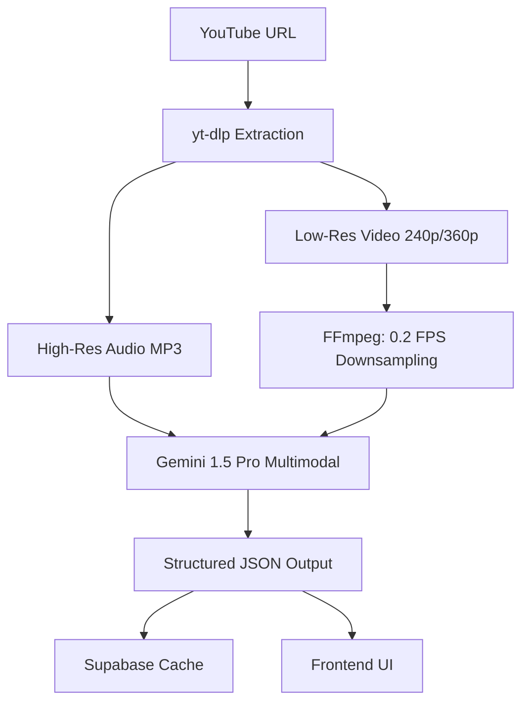

# 🍳 WokTalk (鑊氣)
**AI-Powered Multimodal Cooking Assistant & Language Tutor**

---

## 1. Executive Summary

WokTalk is a responsive web application optimized for both desktop and mobile devices. It bridges the gap between language learning and practical application by ingesting international cooking videos and transforming them into a localized Hong Kong Cantonese learning experience.

**Target Persona**: Cantonese heritage speakers who want to cook international recipes while reinforcing language skills (distinct from generic learners on Duolingo or passive viewers on YouTube).

### Core AI Competencies Demonstrated

1. **Context Window Optimization**: Engineering a pipeline that processes "Low-Res Visuals + High-Res Audio" to maximize context window efficiency while minimizing costs (~90% savings vs raw video).
2. **Visual Grounding & Explainability**: Using computer vision to verify audio instructions against actual video actions with confidence scoring.
3. **Persona Engineering**: Utilizing multi-stage prompting to inject authentic cultural personality ("Cha Chaan Teng Uncle" style).
4. **Uncertainty Management**: Explicitly handling conflicts between audio and visual modalities with user-facing explanations.
5. **Edge AI**: Browser-side voice intent recognition for hands-free operation.
6. **Production AI Economics**: Real-time cost tracking and optimization strategies.

---

## 2. AI Architecture & Pipeline

### 2.1 The Input Pipeline (Hybrid Visual-Audio Architecture)



**User Action**: User pastes a YouTube URL.

> [!NOTE]
> **Disclaimer**: For educational portfolio demonstration only. A production release would utilize licensed API partnerships or direct video uploads to comply with YouTube ToS Section 5.B.

**System Action**:

1. **Audio Extraction (High Fidelity)**: `yt-dlp` extracts high-quality audio (`.mp3`)
2. **Visual Extraction (Low Fidelity)**: `yt-dlp` downloads the lowest resolution video stream (240p/360p)
3. **Temporal Downsampling**: FFmpeg processes video to reduce frame rate to **0.2 FPS** (1 frame every 5 seconds)
   - **Optimization Rationale**: Cooking actions are slow. We don't need 60fps to identify "chopping." This drastically reduces token usage.
4. **Multimodal Ingestion**: Audio + Downsampled Video uploaded to Gemini 1.5 Pro

**Alternative Architecture (Considered)**:
- **Whisper → Text → Gemini**: Cheaper and faster for audio-only processing, but loses temporal audio-visual synchronization needed for grounding verification.

### 2.2 The AI Reasoning Engine (LLM)

**Model**: Gemini 1.5 Pro

**System Prompt Strategy** (See `/prompts/` folder for versioned iterations):

**Role**: "Expert HK Chef & Translator"

**Task 1: Grounding & Conflict Resolution**
- Verify audio instructions against video frames
- **Conflict Logic**:
  - If Audio says "Salt" (white granules) but Video shows "Sugar" (white granules) → Mark as `status: "ambiguous"` and prompt user to taste
  - If Audio says "Boil" but Video shows "Fry" → Prioritize Video
  - If silence detected in audio → Flag potential hallucination risk

**Task 2: Wok Hei Detection (Easter Egg)**
- If video contains visible flames or wok-tossing → Automatically insert: "High heat sear for Wok Hei! (上碟前猛火燒鑊，要有鑊氣呀笨仔！)"

**Task 3: "Uncle Style" Post-Processing**
- Prompt: "Rewrite instruction in 'Cha Chaan Teng Uncle' style. Add particles (la, wor). Max 18 chars/line."

### 2.3 The Data Output (JSON Schema)

The AI outputs a strict JSON object with `processing_status` for graceful degradation:

```json
{
  "processing_status": "success",
  "cost_analysis": {
    "tokens_used": 12000,
    "estimated_cost_usd": 0.03,
    "savings_vs_raw_video_percent": 92
  },
  "recipe_meta": {
    "title_en": "Perfect Scrambled Eggs",
    "title_hk": "完美滑蛋",
    "difficulty": "Easy",
    "total_time_minutes": 10,
    "youtube_id": "rJdjsmMQ"
  },
  "ingredients": [
    { 
      "name_en": "Butter", 
      "name_hk": "牛油", 
      "quantity": "20g", 
      "optional": false 
    }
  ],
  "steps": [
    {
      "step_id": 1,
      "timestamp_start": "01:10",
      "timestamp_end": "01:25",
      "instruction_en": "Melt the butter on low heat.",
      "instruction_hk": "細火搞溶牛油啦！",
      "visual_verification": {
        "status": "confirmed",
        "confidence": 0.95,
        "details": "Chef is melting butter in pan.",
        "fallback_note": null
      },
      "timer_config": {
        "has_timer": false,
        "visual_cue": "Butter creates foam (起泡)"
      }
    }
  ]
}
```

### 2.4 Hallucination Detection & Mitigation

**Known Failure Modes** (See `/docs/hallucination_log.md`):

| Input Scenario | Hallucination Type | Root Cause | Fix Applied | Status |
|----------------|-------------------|------------|-------------|--------|
| Silent video segment | AI invented dialogue | Audio track empty/ambient noise | Added silence detection threshold | ✅ Fixed |
| Fast-paced cooking | Missed intermediate steps | 0.2fps too sparse | Adaptive sampling (deferred to v2) | 🔄 Backlog |
| Multiple languages | Mixed translation output | Prompt ambiguity | Added language detection pre-check | ✅ Fixed |
| Non-cooking content | Forced cooking interpretation | No content validation | Added video classification gate | 🔄 In Progress |

---

## 3. UI/UX Design Specification (Frontend)

### 3.0 Mobile-First & "Grease-Mode" Design

**Grease-Mode UX**: Interface designed for dirty hands in a kitchen environment.

- **Macro-Typography**: Text is 50% larger than standard web apps
- **No Micro-Interactions**: All tap targets >60px
- **PWA**: Installable to use Wake Lock API (keeps screen on during cooking)
- **Hybrid Offline Support**:
  - **Text/Timers**: Processed recipes cached in Supabase + LocalStorage. Users can follow text steps without internet.
  - **Video**: Requires active internet connection (YouTube IFrame limitation). UI gracefully degrades to "Text Only" if offline.

### 3.1 Kitchen Portal (Landing Page)

**Visuals**: Clean, minimalist search bar with gradient background

**Error States** (Explicit Handling):
- ❌ "Invalid URL"
- ⏱️ "Video too long (>45mins)"
- 🔧 "Processing Failed - Retry?"

**Loading**: Progress bar showing estimated time based on video length

**Cost Calculator Display**:
```
🎬 Video: 10 minutes
📊 Tokens Used: ~12,000
💰 Estimated Cost: $0.03
🔥 Savings vs Raw Video: 92%
```

### 3.2 Prep Mode (The Learning Phase)

**Goal**: Pre-cooking vocabulary mastery

**Layout**: Anki-style Flashcards

**Media**: YouTube Loops
- Instead of generating GIFs server-side (expensive/slow), the Flashcard embeds the YouTube player starting/stopping at the specific word timestamp
- Example: "牛油 (Butter)" → Loops 01:10-01:15 showing butter being added

**Logic**: Simple Spaced Repetition
- Counter: Must verify 3 times to mark as "mastered"
- Optional: Users can "Skip to Cooking" if they are advanced speakers

### 3.3 Cook Mode (The Sous-Chef Interface)

**Layout Strategy**: 
- **Desktop**: Split-screen (Video left, Instructions right)
- **Mobile**: Fullscreen overlay with swipe gestures

**Component A: The Visual Loop (Video Player)**
- **Technology**: YouTube IFrame API looping specific timestamps
- **Offline Behavior**: If internet connection lost → Player hidden, replaced by static placeholder icon. Text instructions remain fully functional.

**Component B: Command Center**
- **Primary Display**: Huge HK Cantonese text (3rem+ font size)
- **Confidence Badge System**:
  - 🟢 **Green**: "AI is confident ✓" (confidence ≥ 0.9)
  - 🟡 **Yellow**: "AI is guessing - verify yourself" (0.7 ≤ confidence < 0.9)
  - 🔴 **Red**: "Conflict detected - see explanation" (confidence < 0.7)
- **Explainability Toggle**: 
  - "Why I trusted this: Audio confirmed 'fry', Visual confirmed 'pan motion' at 01:24."
  - Shows frame thumbnails used for verification

**Quick Actions**:
- 📋 "Copy Recipe to WhatsApp" (One-tap export with Cantonese text)
- 🚨 "Report Wrong Translation" (User feedback loop for RLHF)
- ⏰ Timer with Cantonese TTS: "時間到啦！"

### 3.4 Hands-Free Voice Control

**Technology**: Web Speech API (Edge-based)

**Strategy**: Push-to-Talk (Primary)

**Reasoning**: "Always Listening" in a noisy kitchen (fans, sizzling) drains battery and has high error rates.

**UX**: 
- Massive bottom-screen button (80px height)
- Tap once to listen, tap again to cancel
- Visual feedback: Pulsing animation during listening

**Fallback**: Large arrow buttons (← →) for manual navigation

**Supported Commands**:
- "下一步" (Next step)
- "重複" (Repeat)
- "計時器" (Start timer)
- "暫停" (Pause)

---

## 4. Technical Architecture

| Layer | Technology | Function | Fallback Strategy |
|-------|------------|----------|-------------------|
| **Frontend** | Next.js + Tailwind + Zustand | Responsive UI | N/A |
| **Backend** | Python (FastAPI) | API Orchestration | Retry with exponential backoff |
| **Database** | Supabase | User progress, cached recipes, auth | LocalStorage for offline |
| **Cache** | Redis (Optional) | Hot recipe caching | Direct DB query |
| **TTS** | Browser SpeechSynthesis | Free, native pronunciation | Text-only fallback |
| **Media** | YouTube IFrame API | ToS-compliant playback | Static placeholder |
| **Voice** | Web Speech API | Edge-based command recognition | Manual buttons |
| **AI** | Gemini 1.5 Pro | Multimodal reasoning & localization | Cached response if API down |
| **Ingestion** | yt-dlp + FFmpeg | Audio/Low-Res Video extraction | Error message + retry |

### Rate Limiting Strategy

- **Gemini API**: 10 requests/minute (free tier)
- **Queue System**: FastAPI background tasks with Redis queue
- **User Feedback**: "Processing queue: 3 videos ahead of you (~5 min wait)"

---

## 5. Development Roadmap (8-Week Plan)

### Phase 0: Foundation (Week 1)
- [x] Set up Repo (Next.js + FastAPI)
- [ ] Configure Supabase project
- [ ] Create `/prompts/` folder with v1 system prompt
- [ ] Initialize `/docs/hallucination_log.md`

### Phase 1: Core Pipeline (Week 2-3)
- [ ] Build yt-dlp + FFmpeg extraction script
- [ ] Implement video content validation (detect non-cooking videos)
- [ ] Refine Gemini 1.5 Pro Prompt (Grounding + Uncle Style)
- [ ] Add silence detection for hallucination prevention
- [ ] **Milestone**: Single video input → Valid JSON output

### Phase 2: Basic UI (Week 3-4)
- [ ] Build YouTube Embed Player with timestamp sync
- [ ] Implement Step Navigation (Manual)
- [ ] Add Confidence Badge System (Green/Yellow/Red)
- [ ] **Milestone**: End-to-end demo video (Desktop)

### Phase 3: Enhanced UX (Week 5-6)
- [ ] Build Prep Mode (Flashcards using IFrame loops)
- [ ] Implement "Grease-Mode" CSS (large tap targets, macro-typography)
- [ ] Add Cost Calculator display
- [ ] Implement Mobile Responsive Design
- [ ] **Milestone**: Mobile-ready demo

### Phase 4: Voice & Polish (Week 7)
- [ ] Integrate Web Speech API (Push-to-Talk)
- [ ] Add Cantonese TTS for timer alerts
- [ ] Implement "Copy to WhatsApp" feature
- [ ] Add Error Handling & PWA Config
- [ ] **Milestone**: Feature-complete MVP

### Phase 5: Portfolio & Documentation (Week 8)
- [ ] Record Demo Video (3-5 minutes)
- [ ] Write README with:
  - Architecture diagram
  - Prompt iteration log (v1 → v2 → v3)
  - Cost analysis comparison
  - Hallucination case studies
- [ ] Create golden-set test suite (10 known videos)
- [ ] **Milestone**: Portfolio Launch

---

## 6. How This Proves "AI Knowledge"

### 6.1 Cost Optimization
**Demonstrating Production Economics**:
- Context Window Optimization (Audio + Low-Res Video) saves ~90% of token costs vs raw video upload
- Real-time cost tracking visible to users
- Comparison metrics: "This 10-min video cost $0.03 instead of $0.30"

### 6.2 Failure Analysis & Transparency
**Hallucination Log** (`/docs/hallucination_log.md`):
- Documents specific AI failures and fixes
- Shows understanding of model limitations
- Demonstrates iterative prompt engineering

### 6.3 System Thinking
**Full-Stack AI Integration**:
- Hybrid architecture (Supabase + Edge AI + Cloud LLM)
- Graceful degradation strategies
- Offline-first design for critical features

### 6.4 Explainability & Trust
**User-Facing AI Transparency**:
- Confidence scoring with visual badges
- Explainability toggle showing reasoning
- Conflict detection with actionable guidance

### 6.5 Persona Engineering
**Cultural Localization**:
- Multi-stage prompting for "Uncle Style" personality
- Beyond generic translation (Cantonese particles: la, wor, lor)
- Easter eggs (Wok Hei detection) showing domain expertise

### 6.6 Prompt Engineering Documentation
**Versioned Prompt Evolution** (`/prompts/`):
```
v1_basic.md: "Translate to Cantonese" 
  → Too generic, no personality

v2_personality.md: "Translate as if you're a grumpy uncle..."
  → Better tone, but hallucinations on silent segments

v3_grounded.md: Added grounding instructions + conflict logic
  → Current production version
```

---

## 7. Testing Strategy

### 7.1 Golden-Set Test Suite
**10 Known Videos** covering edge cases:
1. ✅ Standard cooking video (baseline)
2. ⚠️ Silent cooking video (ASMR style)
3. ⚠️ Fast-paced cooking (30-second recipe)
4. ⚠️ Multi-language video (Japanese with English subs)
5. ❌ Non-cooking content (should reject)
6. ✅ Wok cooking (should trigger Easter egg)
7. ⚠️ Low-quality audio (background music)
8. ✅ Long-form video (30+ minutes)
9. ⚠️ Ingredient ambiguity (salt vs sugar)
10. ✅ Complex recipe (multiple steps)

### 7.2 Automated Tests
- Unit tests for FFmpeg frame extraction
- Integration tests for Gemini API responses
- E2E tests for YouTube IFrame sync

### 7.3 Manual Verification
- User testing with native Cantonese speakers
- Kitchen environment testing (grease-mode validation)
- Voice command accuracy in noisy environments

---

## 8. Deferred Roadmap (Post-MVP)

> [!CAUTION]
> These features were considered but removed from MVP to reduce technical risk or cost.

### 8.1 Full Offline Video Mode
**Blocker**: Requires downloading and hosting video files, which violates YouTube ToS.
**Future Solution**: Support user-uploaded raw video files (MP4) for full offline capability.

### 8.2 Server-Side GIF Generation
**Blocker**: CPU-intensive and requires storage.
**Current Workaround**: MVP uses YouTube IFrame loops.
**Future Solution**: Cloudinary for on-the-fly GIF generation.

### 8.3 Adaptive Frame Sampling
**Concept**: Increase frame rate dynamically based on audio activity (e.g., 1 FPS during active cooking, 0.1 FPS during narration).
**Deferred**: Adds complexity to ingestion pipeline.

### 8.4 Cross-Recipe RAG
**Concept**: "Chat with your Cookbook" feature to search across all processed recipes.
**Example**: "Show me all recipes using ginger" or "What's the fastest stir-fry?"
**Deferred**: Requires vector database (Pinecone/Weaviate) and additional LLM costs.

### 8.5 User Feedback Loop (RLHF)
**Concept**: "Report Wrong Translation" button feeds into fine-tuning dataset.
**Deferred**: Requires significant data collection before fine-tuning is viable.

---

## 9. Quick Wins (Low-Effort, High-Impact)

1. ✅ **"Copy Recipe to WhatsApp"** - One-tap export with Cantonese text
2. ✅ **Cantonese Timer Sound** - TTS announces "時間到啦！" when timer ends
3. ✅ **Confidence Badge System** - Visual trust indicators
4. 🔄 **Dark Mode** - Essential for kitchen environments (reduces glare)
5. 🔄 **Recipe Bookmarking** - Save favorites to Supabase

---

## 10. Open Questions & Considerations

### 10.1 Content Validation
**Q**: What if the video has no cooking at all?
**A**: Implement pre-processing classification:
- Use Gemini Vision on first 10 frames
- If confidence < 0.5 for "cooking content" → Reject with message: "This doesn't look like a cooking video. Try another!"

### 10.2 Multi-Language Handling
**Q**: How to handle videos with multiple languages (e.g., Japanese cooking with English subtitles)?
**A**: 
- Detect primary audio language using Whisper
- If non-English/Cantonese → Add disclaimer: "Original language: Japanese. Translation may be less accurate."

### 10.3 Rate Limiting User Experience
**Q**: What's the user experience when rate-limited?
**A**: 
- Show queue position: "3 videos ahead of you (~5 min wait)"
- Option to save URL and get email notification when ready
- Premium tier (future): Priority processing

---

## Appendix A: Prompt Engineering Examples

### Example: v3 System Prompt (Current)

```markdown
You are an expert Hong Kong chef and Cantonese translator. Your task is to analyze a cooking video and create step-by-step instructions.

GROUNDING RULES:
1. Verify each audio instruction against the video frames
2. If audio and video conflict:
   - Visual actions override audio for techniques (e.g., "boil" vs "fry")
   - Flag ambiguous ingredients (e.g., salt vs sugar) with status: "ambiguous"
3. If you detect silence (>3 seconds) in audio, do NOT invent dialogue

TRANSLATION STYLE:
- Write as if you're a "Cha Chaan Teng Uncle" (茶餐廳師傅)
- Use Cantonese particles: 啦 (la), 喎 (wor), 囉 (lor)
- Maximum 18 characters per line
- Be direct and slightly impatient (authentic style)

SPECIAL DETECTION:
- If you see flames or wok-tossing → Add: "上碟前猛火燒鑊，要有鑊氣呀笨仔！"

OUTPUT FORMAT: Strict JSON (see schema)
```

---

## Appendix B: Cost Analysis

### Token Usage Breakdown (10-minute video)

| Component | Resolution | Tokens | Cost (USD) |
|-----------|-----------|--------|------------|
| **Raw Video** (Baseline) | 1080p @ 30fps | ~120,000 | $0.30 |
| **Our Pipeline** | 240p @ 0.2fps + Audio | ~12,000 | $0.03 |
| **Savings** | - | **90%** | **$0.27** |

**Assumptions**:
- Gemini 1.5 Pro pricing: $0.025 per 1K tokens (input)
- 10-minute video = 600 seconds
- Raw: 600s × 30fps = 18,000 frames
- Ours: 600s × 0.2fps = 120 frames

---

**Document Version**: 2.0  
**Last Updated**: 2026-01-29  
**Status**: Ready for Implementation
